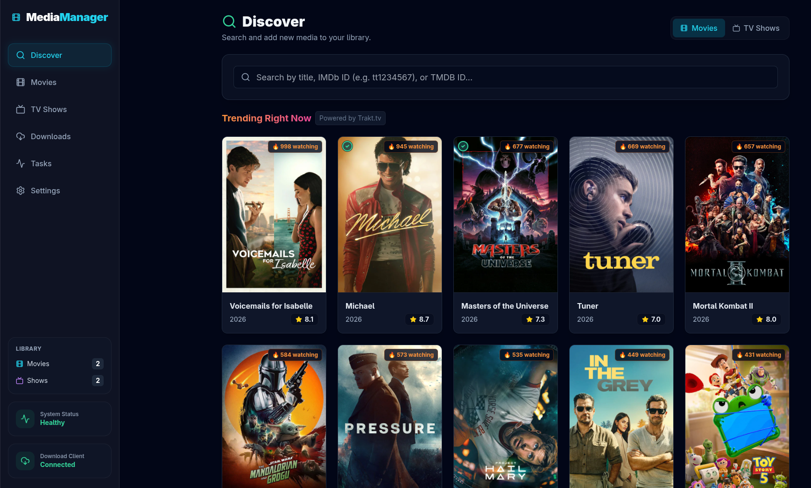

# MediaManager 🎬

An elegant, all-in-one media management dashboard designed to seamlessly track, search, and download your favorite Movies and TV Shows. 



## Features ✨

- **Modern Dashboard:** A beautifully designed, highly responsive UI built with React and Tailwind CSS featuring a sleek dark mode.
- **Media Tracking:** Easily monitor upcoming and existing Movies and TV Shows, complete with dynamic status indicators.
- **Smart Discovery:** Search for new content from TMDB and instantly add it to your library.
- **Download Client Integration:** Connect to your favorite download clients to view and manage live torrents directly from the dashboard.
- **Indexer Support:** Built-in integration with indexer managers (like Prowlarr) for automatic searches.
- **System Health:** Integrated system issue monitoring for missing API keys, indexers, or disconnected download clients.
- **Customizable Views:** Switch seamlessly between grid and list layouts with advanced sorting and filtering options (by status, rating, and release year).
- **Responsive Layout:** fully functional on desktop and tablet screens.

## Tech Stack 🛠️

- **Frontend:** React, Vite, Tailwind CSS, Lucide Icons, React Router
- **Backend:** Node.js, Express
- **Database:** SQLite (better-sqlite3)
- **External APIs:** TMDB (The Movie Database)

## Getting Started 🚀

### Prerequisites

Ensure you have [Node.js](https://nodejs.org/) installed on your machine.
You will also need a free [TMDB API Key](https://www.themoviedb.org/documentation/api) to fetch movie and TV show data.

### Installation

1. **Clone the repository:**
   ```bash
   git clone https://github.com/Hoaxr/MediaManager.git
   cd MediaManager
   ```

2. **Install dependencies for the server:**
   ```bash
   cd server
   npm install
   ```

3. **Install dependencies for the client:**
   ```bash
   cd ../client
   npm install
   ```

### Running the Application

1. **Start the backend server:**
   ```bash
   cd server
   npm start
   ```
   The server will run on `http://localhost:3000`.

2. **Start the frontend application:**
   Open a new terminal window:
   ```bash
   cd client
   npm run dev
   ```
   The client will be available at `http://localhost:5173`.

### Initial Setup ⚙️

Upon launching the application for the first time, you will see the **System Status** indicating issues.
1. Click on the issues or navigate to the **Settings** page.
2. Enter your **TMDB API Key**.
3. (Optional) Configure your download client and indexers to fully utilize the automatic search and download features.

## Contributing 🤝

Contributions, issues, and feature requests are welcome! Feel free to check the [issues page](https://github.com/Hoaxr/MediaManager/issues).

## License 📝

This project is licensed under the MIT License.
